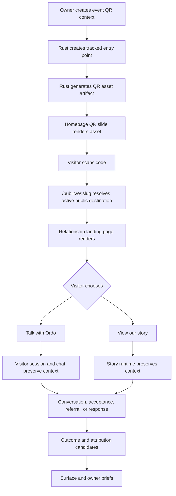

# Scrollytelling Runtime And Tracked QR Architecture

Status: draft architecture for future issues

This document defines the target architecture for two related public surfaces:

- a cinematic Ordo homepage/story runtime; and
- a reliable relationship-aware QR/referral landing page.

Both surfaces remain governed by Ordo's local-first backend. The design combines
lessons from the `testing` presentation site with Ordo's existing business
truth, public surfaces, tracked entry points, visitor sessions, offers, trials,
conversations, attribution, and evidence spines.

This is not an implementation plan for the current working tree. It is a
planning artifact for future issue creation.

## Product Intent

Ordo is a solopreneur growth engine:

```text
Local truth -> public story -> tracked entry -> relationship conversation
-> offer, ask, referral, or trial -> outcome -> brief -> better next action
```

The homepage should not be a static marketing page. It should be the public
narrative brief of the business: evidence-backed, motion-rich, readable, and
able to route a visitor into Ordo with durable attribution.

The referral or QR landing page has a different job. It should be personal,
fast, and reliable:

```text
This person came from this relationship or context.
Welcome them clearly.
Offer two paths.
Preserve the source context.
Do not lose the lead.
```

The QR moment is central. At an event, in an offer, inside a request, attached
to an artifact, or within a scrollytelling frame, the owner should be able to
show a code and know which business context generated that code:

- event or room;
- offer, ask, request, artifact, or campaign;
- owner/user who generated it;
- approximate location context when deliberately supplied;
- destination slide or surface;
- visitor session;
- later conversation, trial, referral, or outcome.

Ordo should learn from that path without cookie-heavy ad tracking or hidden
surveillance. The goal is not enterprise analytics. The goal is relationship
continuity for a solopreneur, where each lead may matter. When time or
location context is useful, it should be supplied, permitted, and stored as
bounded server-side context behind an opaque entry point.

## First-Class MVP

The first excellent MVP is not a full campaign system. It is a constrained
relationship landing page:

```text
Tracked entry point -> custom landing page -> Talk with Ordo or View our story
```

The landing page should answer four questions:

- Who shared this with me?
- What is Studio Ordo?
- What can I do next?
- Will this context be remembered if I continue?

Default page shape:

```text
Welcome from Ava

Ava shared Studio Ordo with you.

Studio Ordo helps solopreneurs turn conversations, offers, referrals,
and follow-up into an operating system.

[Talk with Ordo]
Ask questions or see whether this fits.

[View our story]
See what Studio Ordo is building.

Ordo is an assistant. Keith can review and follow up when needed.
```

The two actions are intentionally narrow:

- `Talk with Ordo`: primary conversion path. Starts or resumes a visitor
  session and opens chat with referral/event context attached.
- `View our story`: trust path. Opens the scrollytelling homepage/story while
  preserving entry-point or visitor-session attribution.

This landing page is a product surface, not a page-builder. It should use a
small safe template with public-safe fields.

## Existing Foundations

The repo already has backend foundations that this architecture should extend:

- `business_facts` with visibility and publication state.
- Public read models for About, Offers, Asks, and Feed.
- `tracked_entry_points` with slug, public path, QR payload JSON, attribution,
  metadata, status, and public-destination checks.
- `visitor_sessions` and `visitor_session_events`.
- Public routes for `/public/e/:slug` and `/public/visitor-sessions`.
- Offer acceptance and trial state that can preserve visitor-session
  attribution.
- Business outcomes and attribution candidates.
- A deterministic QR-to-trial eval proving the durable chain:

```text
entry point -> visitor session -> conversation -> offer acceptance -> trial
-> business outcome -> attribution evidence
```

Current gap: the backend persists QR payload JSON, but it does not yet generate
QR image assets as Rust-owned artifacts. The frontend homepage is also still a
simple public deck rather than a reusable scrollytelling runtime.

## Non-Goals

- No cookie-heavy ad tracking.
- No fake analytics dashboards.
- No hidden collection of raw personal data.
- No public use of draft, owner-only, staff-only, or revoked facts.
- No QR destination to private surfaces.
- No generic page-builder scope in the first runtime.
- No configurable landing-page builder in the first referral/QR MVP.
- No full affiliate payout automation in this architecture slice.
- No private referrer notes, inferred urgency, hidden lead scoring, or sensitive
  context shown to the visitor.

## Runtime Boundary

The architecture has two cooperating runtimes:

```text
Rust daemon: truth, policy, attribution, QR generation, artifacts, sessions
Next frontend: visual rendering, motion runtime, slide interaction, UI state
```

The frontend may render QR codes and motion, but the durable QR asset, payload,
entry point, provenance, and attribution context should be daemon-owned.

## Domain Nouns

### Scrollytelling

- `NarrativeSurface`: a public surface such as Home/About.
- `NarrativeDeck`: ordered set of public billboards/slides.
- `NarrativeSlide`: one scene in the public story.
- `SlideBlock`: title, text, media, CTA, source/evidence line, QR block, chart,
  proof card, or chat entry.
- `MotionProfile`: reduced, restrained, expressive, or cinematic.
- `SlideManifest`: stable ids, order, titles, directives, evidence refs, and
  destinations.
- `NarrativeTheme`: tokens for color, type, spacing, glass, and motion.

### QR And Growth

- `TrackedEntryPoint`: existing durable record for QR/link/campaign entry.
- `QrAsset`: future durable artifact generated by Rust from a tracked entry
  point.
- `QrContext`: event, owner, user, location, campaign, destination, offer, ask,
  artifact, slide, and allowed attribution fields.
- `RelationshipLandingPage`: public-safe landing page generated from a tracked
  entry point.
- `PublicWelcomeContext`: display-safe referral or event context, such as
  "Ava shared Studio Ordo with you" or "Welcome from the May Founder Meetup."
- `VisitorSession`: existing durable record created after scan/entry.
- `AttributionContext`: public-safe context copied into sessions, offer
  acceptances, outcomes, and briefs.
- `RewardEvent`: candidate or qualified reward evidence copied into Growth
  when a referral, feedback submission, or other program rule qualifies.
- `BusinessOutcome`: durable outcome such as trial started, conversion,
  referral, ask response, partnership, or declined/lost.

## Clean Architecture Layers

```text
Domain
  NarrativeDeck, NarrativeSlide, MotionProfile, QrContext, QrAsset

Application
  ComposeNarrativeDeck
  ComposeRelationshipLandingPage
  ResolvePublicSurfaceNarrative
  GenerateTrackedQrAsset
  StartVisitorSessionFromEntry
  SummarizeSurfacePerformance

Infrastructure
  SQLite repositories
  Rust QR encoder
  Artifact store
  Event appenders
  Public read model adapters

Interface
  Daemon HTTP routes
  Next scrollytelling components
  Owner/studio management UI
  Evals and smoke tests
```

Dependency rule: outer layers depend inward. The motion renderer must not own
business truth, QR attribution, publication state, or visitor identity.

## SOLID Design Rules

- Single responsibility: slide rendering, motion state, QR asset generation,
  entry-point policy, and attribution recording are separate modules.
- Open/closed: new slide block types register through a component registry;
  existing renderer code should not grow `if/else` cascades.
- Liskov substitution: any slide block renderer must work in reduced motion,
  static export, and browser runtime modes.
- Interface segregation: public visitors, owner/studio editors, and daemon jobs
  use separate contracts. Public QR resolution cannot expose owner metadata.
- Dependency inversion: frontend consumes deck/read-model contracts; Rust
  services consume repository traits or narrow data-access modules.

## Useful GoF Patterns

- Strategy: `MotionStrategy` chooses reduced, restrained, expressive, or
  cinematic behavior.
- Factory Method: `SlideBlockFactory` creates renderable blocks from typed deck
  data.
- Abstract Factory: `ThemeFactory` returns compatible typography, color, media,
  and motion token sets.
- Builder: `QrContextBuilder` assembles QR context from event, campaign,
  location, user, destination, and offer/ask/artifact inputs.
- Adapter: public read models adapt existing `business_facts`, offers, asks,
  feed, and artifacts into `NarrativeDeck`.
- Observer: one shared slide observer publishes active slide state to progress,
  keyboard shortcuts, footer gates, and QR slide behavior.
- Command: keyboard actions such as next, previous, jump, palette, and show QR
  are commands with testable handlers.
- State: visitor session, QR asset lifecycle, slide publish lifecycle, and
  motion runtime state are explicit state machines.
- Composite: slides contain blocks; decks contain slides.
- Decorator: provenance, source lines, QR attribution badges, and motion wrappers
  decorate blocks without changing their content contract.
- Facade: `ScrollytellingRuntime` exposes a small frontend API over observer,
  keyboard, progress, motion, and registry internals.

## Frontend Runtime Architecture

The target frontend module should live under a future path like:

```text
components/scrollytelling/
  runtime/
  motion/
  blocks/
  qr/
  theme/
  registry/
```

Recommended public API:

```ts
<NarrativeDeckRenderer deck={deck} runtime={runtimeSettings} />
```

Key frontend pieces:

- `SlideStage`: sticky 100vh stage inside a taller scroll section.
- `SlideObserverProvider`: single source of active-slide truth.
- `MotionProvider`: maps Ordo experience settings to motion strategy.
- `PresentationProgress`: reel/counter/dot progress.
- `PresentationShortcuts`: keyboard navigation and command palette.
- `ParallaxBackground`: image focal point, depth, blur, and reduced-motion
  fallback.
- `Reveal`, `DriftMedia`, `SceneCard`: small motion primitives.
- `SlideBlockRegistry`: maps block kinds to components.
- `QrSlideBlock`: renders daemon-generated QR asset plus public-safe label,
  destination, and fallback link.
- `RelationshipLandingPage`: focused two-action landing surface for referrals,
  events, affiliates, and printed cards.

The frontend must support:

- native scrolling;
- no scroll hijacking;
- space/right/down to advance;
- left/up to go back;
- numeric slide jump;
- clickable progress;
- stable deep links;
- reduced-motion equivalent;
- mobile short-viewport layout;
- Safari/WebKit blur and GPU fallbacks;
- no text overlap at supported breakpoints.

## Relationship Landing Page Contract

The landing page should be separate from the homepage story runtime. It can link
into the story, but it has a different responsibility: orient and route a
visitor who arrived through a specific relationship or event.

Route shape can reuse the existing entry-point route:

```text
/public/e/:slug
```

Resolution behavior:

```text
resolve tracked entry point
verify active status and public destination
render public-safe landing page
preserve attribution for both actions
```

Minimal contract:

```ts
type RelationshipLandingPage = {
  entryPointId: string;
  slug: string;
  kind: "event" | "person_referral" | "affiliate" | "printed_card" | "direct_link";
  publicWelcomeLabel: string;
  publicContextLine: string;
  primaryAction: {
    kind: "talk_with_ordo";
    label: "Talk with Ordo";
    href: string;
  };
  secondaryAction: {
    kind: "view_story";
    label: "View our story";
    href: string;
  };
  trustLine: string;
  attribution: Record<string, unknown>;
};
```

Rendering rules:

- show exactly one welcome line;
- show one short context sentence;
- show exactly two primary choices;
- disclose that Ordo is an assistant;
- never display private notes, scores, inferred needs, or non-public metadata;
- never require the visitor to share personal data before choosing a path.

The default primary path starts chat. The secondary path opens the scrollytelling
homepage. Both paths must preserve context.

## Backend QR Architecture

Rust should own durable QR generation.

Proposed service:

```rust
QrAssetService
  create_or_refresh_asset(entry_point_id, QrContext) -> QrAssetView
  resolve_asset(asset_id) -> QrAssetView
  retire_asset(asset_id, reason) -> QrAssetView
```

Proposed tables or artifact records:

```text
qr_assets
  id
  entry_point_id
  payload_hash
  format                 -- svg, png, maybe pdf later
  artifact_id            -- if stored through generic artifacts
  public_path
  status                 -- active, retired, superseded
  created_by_actor_id
  created_at
  updated_at
  retired_at

qr_asset_context
  qr_asset_id
  context_json           -- public-safe metadata only
  private_context_hashes -- optional hashes for sensitive local matching
```

Payload rule: QR payload should normally be a URL, not a large data blob.

```text
https://<public-host>/public/e/<slug>
```

The durable `TrackedEntryPoint` stores the meaning of the slug. The QR image
only needs to route the scan.

Future local/offline mode may support a signed compact payload, but the first
architecture should prefer URLs because they are easier to scan, revoke, and
route.

## QR And Referral Context Model

`QrContext` should distinguish public-safe context from private/local context.

Public-safe examples:

```json
{
  "source": "event_qr",
  "campaign": "may_founder_meetup",
  "eventLabel": "May Founder Meetup",
  "destinationSurface": "offers",
  "destinationId": "offer_30_day_trial",
  "slideId": "event-qr",
  "landingMode": "relationship_welcome",
  "publicWelcomeLabel": "Welcome from the May Founder Meetup",
  "generatedBy": "owner",
  "generatedAt": "2026-05-12T00:00:00Z"
}
```

Person-referral public-safe example:

```json
{
  "source": "person_referral",
  "referredByConnectionId": "connection_ava",
  "referredByPublicLabel": "Ava",
  "publicWelcomeLabel": "Welcome from Ava",
  "publicContextLine": "Ava shared Studio Ordo with you.",
  "destinationSurface": "landing",
  "primaryAction": "talk_with_ordo",
  "secondaryAction": "view_story"
}
```

Private/local examples:

```json
{
  "preciseLocation": "owner-entered venue address",
  "ownerNotes": "met after talk",
  "operatorDevice": "local device id",
  "referrerPrivateNotes": "owner-only relationship context",
  "expectedAudience": "private invite list"
}
```

Private/local fields should remain local and protected. Public routes and
public QR resolution should not expose them.

Location policy:

- owner-supplied event location may be stored as event context;
- browser geolocation should require explicit permission and clear user intent;
- precise visitor location should not be inferred from scan without consent;
- IP-derived location should not be treated as durable truth;
- visitor-provided profile details belong in the conversation/session flow, not
  hidden QR metadata.

Referral display policy:

- show a person's name only when the owner intentionally creates a public-safe
  referral link using that display label;
- prefer "Ava shared Studio Ordo with you" over stronger inferred claims like
  "Ava thinks you need this";
- do not show private notes, lead value, urgency, owner-only relationship
  details, or inferred needs;
- if the referrer context is ambiguous, fall back to event or business context:
  "Welcome to Studio Ordo."

## QR Lifecycle

```text
Draft context
-> create tracked entry point
-> generate QR asset
-> owner preview
-> publish/use at event
-> scan resolves public entry point
-> relationship landing page renders
-> visitor chooses Talk with Ordo or View our story
-> visitor session starts or is preserved
-> conversation, story, or offer path begins
-> outcome/attribution candidates recorded
-> owner brief summarizes performance
-> QR asset retired or reused with evidence
```

State machines:

```text
TrackedEntryPoint: active | disabled | archived
QrAsset: draft | active | superseded | retired
VisitorSession: active | ended
AttributionCandidate: proposed | confirmed | rejected | superseded
```

## Homepage Narrative Sequence

Initial Ordo homepage target:

```text
1. Identity: Studio Ordo as business appliance
2. Problem: solopreneurs drown in scattered operational drag
3. Transformation: conversations become evidence, artifacts, and follow-up
4. Proof: local-first trust boundary and governed work
5. Offer: 30-day OrdoStudio trial
6. QR/Event: scan to open a relationship landing page for this context
7. Reward: qualified referrals or accepted feedback can earn hosted time
8. Ask: referrals, affiliates, collaborators, feedback
9. Latest: published artifact/feed proof
10. Chat CTA: ask Ordo what fits
```

Each slide should have:

- one message;
- one proof point or visual;
- one action;
- optional evidence/source line;
- optional detail link;
- stable id;
- publication state.

The QR slide should not try to explain the whole product. Its job is to route
the visitor to the focused landing page. The landing page then offers the two
choices: talk now or view the story first.

## Data Flow



## Privacy And Trust Rules

- Public QR resolution returns only public-safe destination data.
- Raw user agent text is hashed or omitted, matching existing behavior.
- Visitor session attribution copies only allowed context.
- Private event notes and precise owner location remain protected.
- Owner can disable or archive a QR entry point.
- Retired QR codes should resolve to a safe expired state, not a private error.
- Every QR-generated outcome should cite evidence refs.
- No fake scarcity, fake social proof, unsupported metrics, or hidden pressure.
- Personalization must be explainable from the visible relationship context:
  referral, event, affiliate, printed card, or direct link.
- The visitor should always know whether they are about to talk with Ordo or
  view the public story.

## Issue Slices

1. Define typed `NarrativeDeck` and `NarrativeSlide` contracts.
2. Add `SlideBlockRegistry` and block-kind contracts.
3. Port internal scrollytelling runtime from the `testing` prototype.
4. Add shared `SlideObserverProvider`.
5. Add keyboard shortcuts and progress reel.
6. Add motion strategy support tied to Ordo experience settings.
7. Add daemon-backed homepage deck adapter from public read models.
8. Add relationship landing page contract for tracked entry points.
9. Add backend public-safe welcome/context fields for referral and event entry
   points.
10. Add landing page UI with exactly two actions: Talk with Ordo and View our
    story.
11. Preserve entry-point and visitor-session context across both actions.
12. Add `QrAssetService` in Rust.
13. Add QR asset storage and artifact/provenance link.
14. Add owner/studio QR context creation contract.
15. Add `QrSlideBlock` rendering against daemon QR assets.
16. Add visitor-session start flow from QR scan to chat/story/offer.
17. Add QR-to-landing-page Playwright smoke.
18. Add Rust tests for QR asset generation, revocation, privacy, and public
    destination boundaries.
19. Add owner brief summarizing QR scans, landing-page choices, sessions, conversations, offers,
    trials, and attribution candidates.

## Open Questions

- Should QR image assets be stored in the generic artifact system immediately,
  or start in a narrow `qr_assets` table and migrate later?
- Which QR formats are required first: SVG only, or SVG plus PNG?
- What public host/base URL is authoritative for local/event demos?
- How much owner-entered event location belongs in public-safe attribution?
- Should QR slides generate one code per event, per offer, per owner, or per
  presentation session?
- What is the consent language when a visitor scans and starts a session?
- Should a visitor session start on landing-page view, or only after choosing
  Talk with Ordo / View our story?
- What is the minimum fallback copy when a referrer label is removed or a
  connection becomes private?
- Should the landing page destination be a new public surface value, or should
  it remain a rendering mode of the existing `/public/e/:slug` route?

## Acceptance Bar

The architecture is ready for implementation issues when it supports this demo:

```text
Owner opens the Ordo homepage at an event.
Owner advances through the scrollytelling deck with the keyboard.
Owner lands on a QR slide for a specific event and offer.
Visitor scans the QR code.
Ordo renders a relationship landing page with two choices.
Visitor chooses Talk with Ordo or View our story.
Ordo preserves entry-point attribution across the chosen path.
Visitor asks a question in Chat.
Ordo can later show the owner a brief connecting the event QR, landing-page
choice, visitor session, conversation, offer acceptance or decline, trial state,
and evidence refs.
```

The story should feel cinematic. The landing page should feel personal, clear,
and trustworthy. Both should be inspectable to the owner.
